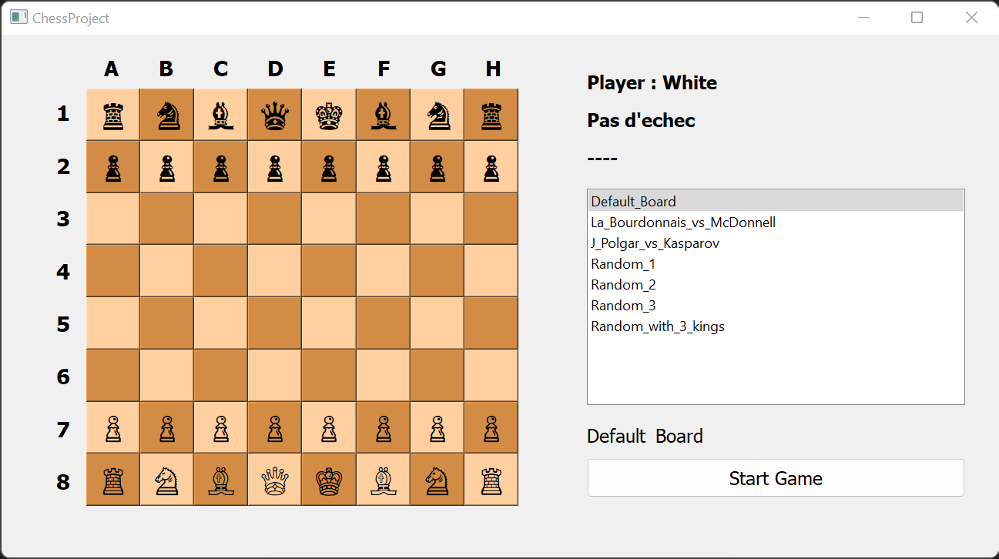
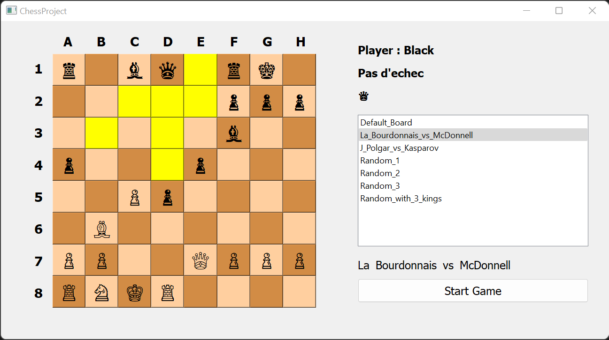
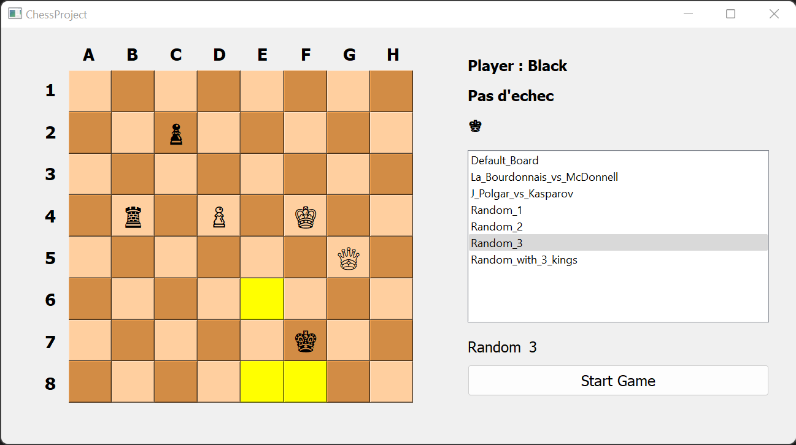
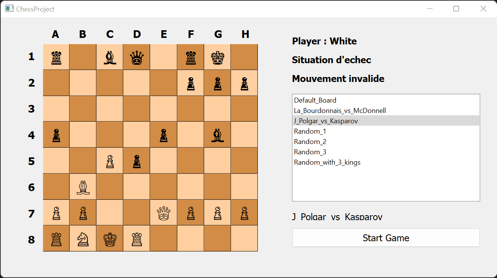

# ♟️ Chess Project

## 📄 Description
Un projet de simulation de jeu d'échecs mettant l'accent sur les fins de partie. Le projet inclut une interface graphique utilisant Qt, et implémente la logique pour gérer les mouvements des pièces d'échecs ainsi que la vérification des situations d'échec.

## 🌟 Fonctionnalités principales
- **♔ Plateau d'échecs** : Affichage interactif d'un plateau 8x8 avec des pièces.
- **✅ Mouvements valides** : Vérification des mouvements autorisés pour chaque pièce.
- **⚠️ Gestion des échecs** : Vérification des situations d'échec pour les rois.
- **🖥️ Interface graphique** : Interface utilisateur créée avec Qt, permettant de jouer avec une souris.
- **📜 Configurations de partie** : Chargement de plusieurs configurations de jeu.

## 📸 Captures d'écran

<table>
  <tr>
    <td>
      
      <p><strong>Description de la capture :</strong></p>
      <ul>
        <li><strong>Plateau d'échecs :</strong>
          <ul>
            <li>Un échiquier classique 8x8 avec des cases alternant beige et marron.</li>
            <li>Les pièces sont représentées par des symboles Unicode, indiquant leur type (roi, dame, etc.) et leur couleur (blanc ou noir).</li>
          </ul>
        </li>
        <li><strong>Interface utilisateur :</strong>
          <ul>
            <li>Une section à droite affiche les informations de la partie :</li>
            <ul>
              <li><strong>Joueur actuel :</strong> Affiché comme "Player : White".</li>
              <li><strong>Situation d'échec :</strong> Indique "Pas d'échec" si aucun roi n'est menacé.</li>
              <li>Une liste déroulante permet de choisir différentes configurations de jeu (par exemple, "Default_Board", "Random_1").</li>
              <li>Un bouton "Start Game" est disponible pour démarrer la partie.</li>
            </ul>
          </ul>
        </li>
        <li><strong>Configuration affichée :</strong> La capture illustre la configuration "Default_Board", où les pièces sont disposées comme dans une partie classique d'échecs.</li>
      </ul>
    </td>
  </tr>
  <tr>
    <td>
      
    </td>
    <td>
      
    </td>
  </tr>
  <tr>
    <td colspan="2">
      <p><em>Lorsqu'une pièce est sélectionnée, ses déplacements possibles sont visualisés par une mise en surbrillance des cases concernées. Si un déplacement place le roi en situation d'échec, il sera automatiquement invalidé.</em></p>
    </td>
  </tr>
    <tr>
    <td>
      
           <p><em>Lorsqu'un mouvement effectué par une pièce place le roi de son propre camp dans une position où il est menacé par une pièce adverse, ce déplacement est automatiquement considéré comme invalide, car les règles des échecs interdisent tout mouvement qui expose directement ou laisse un roi en échec</em></p>
    </td>
  </tr>
</table>


---

## 🛠️ Installation

### 🔧 Prérequis
- **Qt Framework** : Assurez-vous que Qt est installé sur votre machine.
- **C++ Compiler** : Un compilateur compatible avec C++17 ou supérieur.

### 📝 Étapes
1. Clonez ce dépôt :
   ```bash
   git clone <URL-du-dépôt>
   ```
2. Ouvrez le projet dans Qt Creator ou tout autre IDE supportant Qt.
3. Configurez le projet avec CMake ou QMake selon vos préférences.
4. Compilez et exécutez.

📂 Le code source se trouve dans le dossier `VSProject` et un exécutable permettant de tester le projet est disponible dans le dossier `exe`.

## 📁 Structure du projet

- **`main.cpp`** : Point d'entrée du programme.
- **`Display.cpp / Display.h`** : Gestion de l'interface graphique.
- **`Piece.cpp / Piece.h`** : Logique des pièces d'échecs et du plateau.
- **`Resources`** : Fichiers d'assets (images, icônes, etc.).

## 🎮 Instructions d'utilisation

1. **🎲 Lancer le jeu** : Au démarrage, sélectionnez une configuration de plateau et cliquez sur "Start Game".
2. **🔄 Déplacer une pièce** : Cliquez sur une pièce puis sur une case valide pour effectuer un déplacement.
3. **📜 Changer de configuration** : Utilisez la liste déroulante pour choisir une autre configuration de partie.

## 🧪 Tests

Le projet utilise Google Test pour la vérification de la logique des mouvements.
- Pour exécuter les tests, assurez-vous que Google Test est configuré et compilez avec l'option `TEST` activée.

## 🤝 Contributions

Les contributions sont les bienvenues ! Veuillez suivre les étapes suivantes :
1. Forkez ce dépôt.
2. Créez une branche pour votre fonctionnalité :
   ```bash
   git checkout -b nouvelle-fonctionnalite
   ```
3. Effectuez vos modifications et testez-les.
4. Soumettez une pull request.

## ✨ Auteurs
- **Selim Mahjoub**
- **Brice Tangmouo Manfo**
- **Bryan Alexandre Tavares**

## 📜 Licence
Ce projet est sous licence MIT. Voir le fichier `LICENSE` pour plus de détails.
